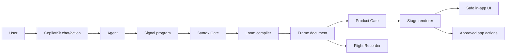
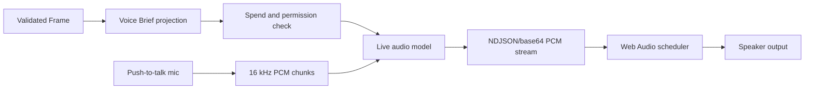

# CopilotKit Hackathon: Signal UI

This is a hackathon brief for a deliberately cut-down, renamed, non-secret
version of an internal agent-UI prototype. The target is not public websites. The target is
SaaS and internal applications where an agent needs to create useful, safe,
branded UI inside an existing product.

The thesis:

> Agents should not write raw HTML, arbitrary React, or giant declarative JSON
> trees. They should emit compact business-intent commands that compile into a
> strict, renderable, inspectable UI plan.

## New Names

Do not use old names in the hackathon project.

| Concept | Hackathon Name | Plain English |
| --- | --- | --- |
| Wire protocol | Signal | What the agent says it wants to show or do |
| Render document | Frame | The safe UI plan the app can render |
| Compiler/composer | Loom | Deterministic converter from Signal to Frame |
| Primitive component | Tiles | Small approved UI primitives |
| Certification | Gate | Checks that reject broken or risky output |
| Renderer | Stage | React renderer for Frame documents |
| Runtime state | Session Pad | Per-thread state and saved views |
| Inspector | Flight Recorder | Debug view for Signal, Frame, and Gate results |

Working product name options:

- Signal UI
- LoomKit
- FramePilot
- Copilot Canvas
- Agent Panels

Recommended hackathon name: **Signal UI**.

## What We Are Building

Signal UI is a tiny protocol and renderer that lets a CopilotKit agent create
internal-app panels like:

- renewal-risk dashboards;
- customer support triage views;
- sales forecast summaries;
- incident response consoles;
- approval review panels;
- ops runbooks;
- product analytics drilldowns;
- account or ticket workspaces.

It is not a website builder. It is not a page-builder. It is not a general
browser sandbox. It is an in-app agent surface for structured, reviewable,
actionable UI.

## Why This Is Different

Most agent UI approaches choose one of two weak extremes:

1. **Plain chat**: safe, but not very useful for real workflows.
2. **Raw generated UI**: impressive, but dangerous, unreviewable, and hard to
   persist.

Signal UI sits in the middle:

- The agent emits **intent commands**, not pixels.
- The app compiles those commands into **approved Tiles**.
- The renderer controls layout, theming, accessibility, and action wiring.
- The Gate rejects output that would be broken, unsafe, or unsupported.

The agent can ask for "a churn-risk panel with three metrics, a prioritized
account table, and an approval button." It cannot inject HTML, CSS, JS, iframes,
or arbitrary network calls.

## Architecture



### The Three Layers

1. **Signal**
   A compact command stream. It describes business intent and rough structure.
   It is optimized for agent authoring.

2. **Frame**
   A strict render plan. It is optimized for validation and rendering.

3. **Stage**
   A React renderer that maps Frame Tiles to real product components.

## Hard Rules

- No raw HTML.
- No iframes.
- No arbitrary JavaScript.
- No inline CSS.
- No unapproved component imports.
- No direct database queries from the agent.
- No unknown actions.
- No unknown data sources.
- No external links unless the host app explicitly allows them.
- No rendering before validation.
- No "mostly valid" output.

## MVP Scope

For the hackathon, support only these Tiles:

| Tile | Use |
| --- | --- |
| `hero` | One-line summary of the panel |
| `metric` | KPI with label, value, optional trend |
| `table` | Records from an approved data source |
| `record` | Single account/user/ticket/object summary |
| `chart` | Simple bar, line, or donut chart |
| `form` | Controlled input form |
| `approval` | Human approval or rejection |
| `timeline` | Ordered events |
| `note` | Plain text explanation |
| `stack` | Vertical grouping |
| `tabs` | Small number of alternate views |
| `empty` | Safe fallback |

This is enough to demo real internal SaaS workflows without exposing any
advanced website generation ideas.

## Signal: Agent Authoring Format

Signal is intentionally not HTML and not a full declarative UI tree. Think of it
as an event log or a tiny command language.

Example:

```signal
panel renewal_risk "Renewal risk cockpit"
audience "Customer Success Manager"

source accounts = crm.accounts where renewal_days < 45 order risk desc limit 20

metric at_risk_arr "At-risk ARR" from accounts.sum(arr) tone danger
metric renewals "Renewals due" from accounts.count() tone neutral
metric saved "Saved this month" value "$184k" tone success

table risky_accounts from accounts
  columns account, owner, arr, renewal_date, risk, next_step
  row_action open_account(account_id)

approval discount_request "Approve retention discount"
  subject accounts.first(account)
  approve approve_discount(account_id)
  reject reject_discount(account_id)

note guidance "Start with accounts over $50k ARR and no executive sponsor."
```

The point is not the exact syntax. The point is the shape:

- commands are compact;
- commands are semantic;
- commands reference approved sources and actions;
- layout is implied, not hand-authored pixel by pixel.

## Signal Packet Alternative

If a line parser is too much for the hackathon, use packet JSON internally while
still presenting Signal as a command stream.

```ts
export type SignalPacket =
  | {
      op: "panel";
      id: string;
      title: string;
      audience?: string;
    }
  | {
      op: "source";
      id: string;
      source: ApprovedSourceId;
      filter?: SourceFilter;
      order?: SourceOrder;
      limit?: number;
    }
  | {
      op: "metric";
      id: string;
      label: string;
      value: ValueExpr;
      tone?: Tone;
    }
  | {
      op: "table";
      id: string;
      sourceId: string;
      columns: string[];
      rowAction?: ActionExpr;
    }
  | {
      op: "approval";
      id: string;
      label: string;
      subject: ValueExpr;
      approve: ActionExpr;
      reject: ActionExpr;
    }
  | {
      op: "note";
      id: string;
      text: string;
    };

export type ApprovedSourceId =
  | "crm.accounts"
  | "support.tickets"
  | "billing.invoices"
  | "security.incidents"
  | "product.events";

export type Tone = "neutral" | "success" | "warning" | "danger";

export type ValueExpr =
  | { kind: "literal"; value: string | number | boolean | null }
  | { kind: "sourceAggregate"; sourceId: string; fn: "count" | "sum" | "avg"; field?: string }
  | { kind: "sourceField"; sourceId: string; field: string; row?: "first" | "selected" };

export type ActionExpr = {
  actionId: ApprovedActionId;
  args?: Record<string, string>;
};

export type ApprovedActionId =
  | "open_account"
  | "approve_discount"
  | "reject_discount"
  | "assign_ticket"
  | "create_followup"
  | "ack_incident";
```

## Frame: Strict Render Plan

Frame is what the app renders. It is more explicit than Signal, but still safe.
The agent should not directly author Frame in the MVP. Signal compiles into
Frame.

```ts
export type FrameDocument = {
  version: "frame.v0";
  id: string;
  title: string;
  audience?: string;
  theme?: {
    density?: "compact" | "comfortable";
    tone?: "neutral" | "focused" | "urgent";
  };
  data: FrameDataSource[];
  actions: FrameAction[];
  tiles: FrameTile[];
};

export type FrameDataSource = {
  id: string;
  source: ApprovedSourceId;
  filter?: SourceFilter;
  order?: SourceOrder;
  limit: number;
};

export type FrameAction = {
  id: string;
  actionId: ApprovedActionId;
  label: string;
  requiredRole?: "member" | "manager" | "admin";
  confirm?: boolean;
};

export type FrameTile =
  | HeroTile
  | MetricTile
  | TableTile
  | ApprovalTile
  | NoteTile
  | StackTile
  | EmptyTile;

export type HeroTile = {
  kind: "hero";
  id: string;
  title: string;
  subtitle?: string;
};

export type MetricTile = {
  kind: "metric";
  id: string;
  label: string;
  value: ValueExpr;
  tone: Tone;
};

export type TableTile = {
  kind: "table";
  id: string;
  sourceId: string;
  columns: Array<{
    key: string;
    label: string;
    format?: "text" | "currency" | "date" | "percent" | "badge";
  }>;
  rowActionId?: string;
};

export type ApprovalTile = {
  kind: "approval";
  id: string;
  label: string;
  subject: ValueExpr;
  approveActionId: string;
  rejectActionId: string;
};

export type NoteTile = {
  kind: "note";
  id: string;
  text: string;
};

export type StackTile = {
  kind: "stack";
  id: string;
  children: string[];
};

export type EmptyTile = {
  kind: "empty";
  id: string;
  message: string;
};
```

## Zod Gate Example

```ts
import { z } from "zod";

const idSchema = z.string().regex(/^[a-z][a-z0-9_]{1,40}$/);
const toneSchema = z.enum(["neutral", "success", "warning", "danger"]);
const sourceIdSchema = z.enum([
  "crm.accounts",
  "support.tickets",
  "billing.invoices",
  "security.incidents",
  "product.events",
]);
const actionIdSchema = z.enum([
  "open_account",
  "approve_discount",
  "reject_discount",
  "assign_ticket",
  "create_followup",
  "ack_incident",
]);

const valueExprSchema: z.ZodType<ValueExpr> = z.discriminatedUnion("kind", [
  z.object({
    kind: z.literal("literal"),
    value: z.union([z.string(), z.number(), z.boolean(), z.null()]),
  }),
  z.object({
    kind: z.literal("sourceAggregate"),
    sourceId: idSchema,
    fn: z.enum(["count", "sum", "avg"]),
    field: z.string().optional(),
  }),
  z.object({
    kind: z.literal("sourceField"),
    sourceId: idSchema,
    field: z.string(),
    row: z.enum(["first", "selected"]).optional(),
  }),
]);

const frameTileSchema = z.discriminatedUnion("kind", [
  z.object({
    kind: z.literal("hero"),
    id: idSchema,
    title: z.string().min(1).max(120),
    subtitle: z.string().max(240).optional(),
  }),
  z.object({
    kind: z.literal("metric"),
    id: idSchema,
    label: z.string().min(1).max(80),
    value: valueExprSchema,
    tone: toneSchema,
  }),
  z.object({
    kind: z.literal("table"),
    id: idSchema,
    sourceId: idSchema,
    columns: z.array(
      z.object({
        key: z.string().min(1).max(80),
        label: z.string().min(1).max(80),
        format: z.enum(["text", "currency", "date", "percent", "badge"]).optional(),
      })
    ).min(1).max(8),
    rowActionId: idSchema.optional(),
  }),
  z.object({
    kind: z.literal("approval"),
    id: idSchema,
    label: z.string().min(1).max(100),
    subject: valueExprSchema,
    approveActionId: idSchema,
    rejectActionId: idSchema,
  }),
  z.object({
    kind: z.literal("note"),
    id: idSchema,
    text: z.string().min(1).max(800),
  }),
  z.object({
    kind: z.literal("stack"),
    id: idSchema,
    children: z.array(idSchema).min(1).max(12),
  }),
  z.object({
    kind: z.literal("empty"),
    id: idSchema,
    message: z.string().min(1).max(180),
  }),
]);

export const frameDocumentSchema = z.object({
  version: z.literal("frame.v0"),
  id: idSchema,
  title: z.string().min(1).max(120),
  audience: z.string().max(120).optional(),
  theme: z.object({
    density: z.enum(["compact", "comfortable"]).optional(),
    tone: z.enum(["neutral", "focused", "urgent"]).optional(),
  }).optional(),
  data: z.array(z.object({
    id: idSchema,
    source: sourceIdSchema,
    filter: z.unknown().optional(),
    order: z.unknown().optional(),
    limit: z.number().int().min(1).max(100),
  })).max(8),
  actions: z.array(z.object({
    id: idSchema,
    actionId: actionIdSchema,
    label: z.string().min(1).max(80),
    requiredRole: z.enum(["member", "manager", "admin"]).optional(),
    confirm: z.boolean().optional(),
  })).max(20),
  tiles: z.array(frameTileSchema).min(1).max(40),
}).strict();
```

## Product Gate

The schema gate only proves the shape is valid. The Product Gate proves the
document is safe to render in this app.

```ts
export type GateResult =
  | { ok: true }
  | { ok: false; errors: string[] };

export function gateFrame(frame: FrameDocument, ctx: GateContext): GateResult {
  const errors: string[] = [];
  const dataIds = new Set(frame.data.map((source) => source.id));
  const actionIds = new Set(frame.actions.map((action) => action.id));
  const tileIds = new Set(frame.tiles.map((tile) => tile.id));

  if (tileIds.size !== frame.tiles.length) {
    errors.push("Tile ids must be unique.");
  }

  for (const source of frame.data) {
    if (!ctx.allowedSources.has(source.source)) {
      errors.push(`Source is not allowed: ${source.source}`);
    }
  }

  for (const action of frame.actions) {
    if (!ctx.allowedActions.has(action.actionId)) {
      errors.push(`Action is not allowed: ${action.actionId}`);
    }
    if (action.requiredRole && !ctx.userRoles.has(action.requiredRole)) {
      errors.push(`User lacks role for action: ${action.id}`);
    }
  }

  for (const tile of frame.tiles) {
    if (tile.kind === "table" && !dataIds.has(tile.sourceId)) {
      errors.push(`Table references missing source: ${tile.sourceId}`);
    }
    if (tile.kind === "table" && tile.rowActionId && !actionIds.has(tile.rowActionId)) {
      errors.push(`Table references missing action: ${tile.rowActionId}`);
    }
    if (tile.kind === "approval") {
      if (!actionIds.has(tile.approveActionId)) errors.push(`Missing approve action: ${tile.approveActionId}`);
      if (!actionIds.has(tile.rejectActionId)) errors.push(`Missing reject action: ${tile.rejectActionId}`);
    }
    if (tile.kind === "stack") {
      for (const childId of tile.children) {
        if (!tileIds.has(childId)) errors.push(`Stack references missing tile: ${childId}`);
      }
    }
  }

  return errors.length ? { ok: false, errors } : { ok: true };
}

export type GateContext = {
  allowedSources: Set<ApprovedSourceId>;
  allowedActions: Set<ApprovedActionId>;
  userRoles: Set<"member" | "manager" | "admin">;
};
```

## Loom Compiler Sketch

The compiler makes layout and safety decisions. The agent does not get to
choose everything.

```ts
export function compileSignalToFrame(program: SignalPacket[]): FrameDocument {
  const panel = program.find((packet) => packet.op === "panel");
  if (!panel || panel.op !== "panel") {
    return emptyFrame("untitled", "The agent did not provide a panel.");
  }

  const data: FrameDataSource[] = [];
  const actions: FrameAction[] = [];
  const tiles: FrameTile[] = [
    {
      kind: "hero",
      id: "hero",
      title: panel.title,
      subtitle: panel.audience ? `For ${panel.audience}` : undefined,
    },
  ];

  for (const packet of program) {
    switch (packet.op) {
      case "panel":
        break;

      case "source":
        data.push({
          id: packet.id,
          source: packet.source,
          filter: packet.filter,
          order: packet.order,
          limit: packet.limit ?? 25,
        });
        break;

      case "metric":
        tiles.push({
          kind: "metric",
          id: packet.id,
          label: packet.label,
          value: packet.value,
          tone: packet.tone ?? "neutral",
        });
        break;

      case "table": {
        const rowActionId = packet.rowAction ? `${packet.id}_row_action` : undefined;
        if (packet.rowAction && rowActionId) {
          actions.push({
            id: rowActionId,
            actionId: packet.rowAction.actionId,
            label: titleFromAction(packet.rowAction.actionId),
          });
        }
        tiles.push({
          kind: "table",
          id: packet.id,
          sourceId: packet.sourceId,
          columns: packet.columns.slice(0, 8).map((key) => ({
            key,
            label: humanize(key),
            format: guessFormat(key),
          })),
          rowActionId,
        });
        break;
      }

      case "approval": {
        const approveActionId = `${packet.id}_approve`;
        const rejectActionId = `${packet.id}_reject`;
        actions.push({
          id: approveActionId,
          actionId: packet.approve.actionId,
          label: "Approve",
          requiredRole: "manager",
          confirm: true,
        });
        actions.push({
          id: rejectActionId,
          actionId: packet.reject.actionId,
          label: "Reject",
          requiredRole: "manager",
          confirm: true,
        });
        tiles.push({
          kind: "approval",
          id: packet.id,
          label: packet.label,
          subject: packet.subject,
          approveActionId,
          rejectActionId,
        });
        break;
      }

      case "note":
        tiles.push({
          kind: "note",
          id: packet.id,
          text: packet.text,
        });
        break;
    }
  }

  return {
    version: "frame.v0",
    id: panel.id,
    title: panel.title,
    audience: panel.audience,
    theme: { density: "compact", tone: "focused" },
    data,
    actions,
    tiles,
  };
}

function emptyFrame(id: string, message: string): FrameDocument {
  return {
    version: "frame.v0",
    id,
    title: "Empty panel",
    data: [],
    actions: [],
    tiles: [{ kind: "empty", id: "empty", message }],
  };
}
```

## Stage Renderer Sketch

The Stage renderer should use the host product's existing design system. For
the hackathon, these components can be simple.

```tsx
type StageProps = {
  frame: FrameDocument;
  data: ResolvedFrameData;
  onAction: (action: FrameAction, args?: Record<string, unknown>) => Promise<void>;
};

export function Stage({ frame, data, onAction }: StageProps) {
  const actionsById = new Map(frame.actions.map((action) => [action.id, action]));

  return (
    <section className="signal-stage" data-density={frame.theme?.density ?? "compact"}>
      {frame.tiles.map((tile) => (
        <TileView
          key={tile.id}
          tile={tile}
          data={data}
          actionsById={actionsById}
          onAction={onAction}
        />
      ))}
    </section>
  );
}

function TileView(props: {
  tile: FrameTile;
  data: ResolvedFrameData;
  actionsById: Map<string, FrameAction>;
  onAction: StageProps["onAction"];
}) {
  const { tile, data, actionsById, onAction } = props;

  switch (tile.kind) {
    case "hero":
      return (
        <header className="tile tile-hero">
          <h2>{tile.title}</h2>
          {tile.subtitle ? <p>{tile.subtitle}</p> : null}
        </header>
      );

    case "metric":
      return (
        <article className={`tile tile-metric tone-${tile.tone}`}>
          <span>{tile.label}</span>
          <strong>{formatValue(resolveValue(tile.value, data))}</strong>
        </article>
      );

    case "table": {
      const rows = data[tile.sourceId] ?? [];
      const action = tile.rowActionId ? actionsById.get(tile.rowActionId) : undefined;
      return (
        <article className="tile tile-table">
          <table>
            <thead>
              <tr>
                {tile.columns.map((column) => <th key={column.key}>{column.label}</th>)}
              </tr>
            </thead>
            <tbody>
              {rows.map((row, index) => (
                <tr key={String(row.id ?? index)}>
                  {tile.columns.map((column) => (
                    <td key={column.key}>{formatCell(row[column.key], column.format)}</td>
                  ))}
                  {action ? (
                    <td>
                      <button onClick={() => onAction(action, { rowId: row.id })}>
                        {action.label}
                      </button>
                    </td>
                  ) : null}
                </tr>
              ))}
            </tbody>
          </table>
        </article>
      );
    }

    case "approval": {
      const approve = actionsById.get(tile.approveActionId);
      const reject = actionsById.get(tile.rejectActionId);
      return (
        <article className="tile tile-approval">
          <h3>{tile.label}</h3>
          <p>{formatValue(resolveValue(tile.subject, data))}</p>
          <div className="approval-actions">
            {reject ? <button onClick={() => onAction(reject)}>Reject</button> : null}
            {approve ? <button onClick={() => onAction(approve)}>Approve</button> : null}
          </div>
        </article>
      );
    }

    case "note":
      return <p className="tile tile-note">{tile.text}</p>;

    case "stack":
      return null; // MVP can ignore or resolve nested children in a second pass.

    case "empty":
      return <p className="tile tile-empty">{tile.message}</p>;
  }
}
```

## Pretext-Style Text Tape

For canvas or dense internal panels, text should be planned before paint. The
hackathon version should not expose a full typography engine. Use a tiny
pretext-style layer called **Text Tape**:

- input: semantic text blocks from Frame Tiles;
- output: measured lines with exact x/y positions;
- renderer: DOM, canvas, or screenshot exporter can all draw from the same tape.

This prevents the usual agent UI failures: labels overflow, tables resize while
loading, long names collide with buttons, and canvas text gets guessed instead
of measured.

```ts
export type TextRole = "title" | "body" | "label" | "mono" | "metric";

export type TextRun = {
  text: string;
  role?: TextRole;
  weight?: "regular" | "medium" | "bold";
  tone?: Tone;
};

export type TextBlock = {
  id: string;
  runs: TextRun[];
  maxLines?: number;
  align?: "left" | "center" | "right";
};

export type TextBox = {
  x: number;
  y: number;
  width: number;
  height: number;
};

export type TextTape = {
  blockId: string;
  lines: TextTapeLine[];
  overflow: boolean;
};

export type TextTapeLine = {
  text: string;
  x: number;
  y: number;
  width: number;
  role: TextRole;
  weight: "regular" | "medium" | "bold";
  tone?: Tone;
};

export type TypeRamp = Record<TextRole, {
  fontFamily: string;
  fontSize: number;
  lineHeight: number;
}>;
```

Minimal text planner:

```ts
export function planTextTape(
  ctx: CanvasRenderingContext2D,
  block: TextBlock,
  box: TextBox,
  ramp: TypeRamp
): TextTape {
  const lines: TextTapeLine[] = [];
  let cursorY = box.y;
  let overflow = false;

  for (const run of block.runs) {
    const role = run.role ?? "body";
    const weight = run.weight ?? "regular";
    const style = ramp[role];
    const words = run.text.trim().split(/\s+/);
    let current = "";

    ctx.font = fontString(style, weight);

    for (const word of words) {
      const next = current ? `${current} ${word}` : word;
      const nextWidth = ctx.measureText(next).width;

      if (nextWidth <= box.width) {
        current = next;
        continue;
      }

      if (current) {
        const placed = placeLine(ctx, current, box, cursorY, role, weight, run.tone, block.align);
        lines.push(placed);
        cursorY += style.lineHeight;
      }

      current = word;

      if (block.maxLines && lines.length >= block.maxLines) {
        overflow = true;
        break;
      }
    }

    if (!overflow && current) {
      const placed = placeLine(ctx, current, box, cursorY, role, weight, run.tone, block.align);
      lines.push(placed);
      cursorY += style.lineHeight;
    }

    if (cursorY > box.y + box.height) {
      overflow = true;
      break;
    }
  }

  if (overflow && lines.length > 0) {
    const last = lines[lines.length - 1]!;
    last.text = ellipsize(ctx, last.text, box.width);
    last.width = ctx.measureText(last.text).width;
  }

  return { blockId: block.id, lines, overflow };
}

function placeLine(
  ctx: CanvasRenderingContext2D,
  text: string,
  box: TextBox,
  y: number,
  role: TextRole,
  weight: "regular" | "medium" | "bold",
  tone: Tone | undefined,
  align: TextBlock["align"] = "left"
): TextTapeLine {
  const width = ctx.measureText(text).width;
  const x =
    align === "center" ? box.x + (box.width - width) / 2 :
    align === "right" ? box.x + box.width - width :
    box.x;

  return { text, x, y, width, role, weight, tone };
}

function ellipsize(ctx: CanvasRenderingContext2D, text: string, maxWidth: number): string {
  let candidate = text;
  while (candidate.length > 1 && ctx.measureText(`${candidate}...`).width > maxWidth) {
    candidate = candidate.slice(0, -1);
  }
  return `${candidate.trimEnd()}...`;
}

function fontString(
  style: TypeRamp[TextRole],
  weight: "regular" | "medium" | "bold"
): string {
  const cssWeight = weight === "bold" ? 700 : weight === "medium" ? 500 : 400;
  return `${cssWeight} ${style.fontSize}px/${style.lineHeight}px ${style.fontFamily}`;
}
```

Canvas drawing from the tape:

```ts
export function drawTextTape(
  ctx: CanvasRenderingContext2D,
  tape: TextTape,
  ramp: TypeRamp,
  palette: Record<Tone | "neutral", string>
) {
  for (const line of tape.lines) {
    const style = ramp[line.role];
    ctx.font = fontString(style, line.weight);
    ctx.textBaseline = "top";
    ctx.fillStyle = palette[line.tone ?? "neutral"];
    ctx.fillText(line.text, line.x, line.y);
  }
}
```

Frame Tiles can opt into Text Tape without knowing about canvas:

```ts
export type TextPlannedMetricTile = MetricTile & {
  textPlan?: {
    labelBlockId: string;
    valueBlockId: string;
  };
};

export function metricToTextBlocks(tile: MetricTile): TextBlock[] {
  return [
    {
      id: `${tile.id}_label`,
      runs: [{ text: tile.label, role: "label", tone: tile.tone }],
      maxLines: 1,
    },
    {
      id: `${tile.id}_value`,
      runs: [{ text: String(tile.value), role: "metric", weight: "bold" }],
      maxLines: 1,
    },
  ];
}
```

## HTML-In-Canvas Sample

For the demo, "HTML in canvas" should mean **safe HTML-like content rendered
into a canvas**, not arbitrary browser HTML injected into a canvas. The browser
canvas API cannot natively lay out real HTML with links, forms, focus, and CSS.
So use one of these two safe approaches:

1. Parse a tiny trusted HTML subset into Text Tape and canvas shapes.
2. Use canvas for visual rendering, then place real DOM controls over it for
   buttons, links, and form fields.

### Safe HTML Subset

This subset is enough for agent explanations inside panels:

- `p`
- `strong`
- `em`
- `code`
- `br`
- `ul`
- `li`

No `style`, `script`, `iframe`, `img`, event handlers, or arbitrary attributes.

```ts
const allowedTags = new Set(["P", "STRONG", "EM", "CODE", "BR", "UL", "LI"]);

export function htmlSnippetToTextBlocks(html: string): TextBlock[] {
  const doc = new DOMParser().parseFromString(html, "text/html");
  const blocks: TextBlock[] = [];

  for (const element of Array.from(doc.body.children)) {
    if (!allowedTags.has(element.tagName)) continue;

    if (element.tagName === "UL") {
      for (const item of Array.from(element.children)) {
        if (item.tagName !== "LI") continue;
        blocks.push({
          id: crypto.randomUUID(),
          runs: [{ text: `- ${item.textContent?.trim() ?? ""}`, role: "body" }],
        });
      }
      continue;
    }

    blocks.push({
      id: crypto.randomUUID(),
      runs: elementToRuns(element),
      maxLines: 4,
    });
  }

  return blocks;
}

function elementToRuns(root: Element): TextRun[] {
  const runs: TextRun[] = [];

  function visit(node: Node, active: Partial<TextRun>) {
    if (node.nodeType === Node.TEXT_NODE) {
      const text = node.textContent?.replace(/\s+/g, " ").trim();
      if (text) runs.push({ text, role: "body", ...active });
      return;
    }

    if (!(node instanceof Element)) return;
    if (!allowedTags.has(node.tagName)) return;

    const next = { ...active };
    if (node.tagName === "STRONG") next.weight = "bold";
    if (node.tagName === "CODE") next.role = "mono";

    for (const child of Array.from(node.childNodes)) {
      visit(child, next);
    }
  }

  visit(root, {});
  return runs;
}
```

### Canvas Panel Renderer

This sample renders a Frame to canvas with simple cards, metrics, notes, and
safe HTML snippets. It is intentionally plain. The point is the architecture:
Frame is validated first, text is measured second, pixels are painted last.

```ts
export function drawFrameToCanvas(input: {
  canvas: HTMLCanvasElement;
  frame: FrameDocument;
  data: ResolvedFrameData;
  ramp: TypeRamp;
}) {
  const { canvas, frame, data, ramp } = input;
  const scale = window.devicePixelRatio || 1;
  const width = canvas.clientWidth;
  const height = canvas.clientHeight;
  const ctx = canvas.getContext("2d");
  if (!ctx) return;

  canvas.width = Math.floor(width * scale);
  canvas.height = Math.floor(height * scale);
  ctx.scale(scale, scale);
  ctx.clearRect(0, 0, width, height);

  const palette = {
    neutral: "#1f2937",
    success: "#047857",
    warning: "#b45309",
    danger: "#b91c1c",
  };

  ctx.fillStyle = "#f8fafc";
  ctx.fillRect(0, 0, width, height);

  let y = 24;
  for (const tile of frame.tiles) {
    const tileHeight = estimateTileHeight(tile);
    drawCard(ctx, 24, y, width - 48, tileHeight);

    if (tile.kind === "hero") {
      const tape = planTextTape(
        ctx,
        {
          id: `${tile.id}_title`,
          runs: [{ text: tile.title, role: "title", weight: "bold" }],
          maxLines: 2,
        },
        { x: 44, y: y + 20, width: width - 88, height: 64 },
        ramp
      );
      drawTextTape(ctx, tape, ramp, palette);
    }

    if (tile.kind === "metric") {
      const value = formatValue(resolveValue(tile.value, data));
      const labelTape = planTextTape(
        ctx,
        { id: `${tile.id}_label`, runs: [{ text: tile.label, role: "label" }], maxLines: 1 },
        { x: 44, y: y + 18, width: width - 88, height: 24 },
        ramp
      );
      const valueTape = planTextTape(
        ctx,
        { id: `${tile.id}_value`, runs: [{ text: value, role: "metric", weight: "bold", tone: tile.tone }], maxLines: 1 },
        { x: 44, y: y + 44, width: width - 88, height: 42 },
        ramp
      );
      drawTextTape(ctx, labelTape, ramp, palette);
      drawTextTape(ctx, valueTape, ramp, palette);
    }

    if (tile.kind === "note") {
      const blocks = htmlSnippetToTextBlocks(`<p>${escapeHtml(tile.text)}</p>`);
      let noteY = y + 18;
      for (const block of blocks) {
        const tape = planTextTape(
          ctx,
          block,
          { x: 44, y: noteY, width: width - 88, height: 72 },
          ramp
        );
        drawTextTape(ctx, tape, ramp, palette);
        noteY += tape.lines.length * ramp.body.lineHeight + 8;
      }
    }

    y += tileHeight + 12;
  }
}

function drawCard(
  ctx: CanvasRenderingContext2D,
  x: number,
  y: number,
  width: number,
  height: number
) {
  ctx.fillStyle = "#ffffff";
  ctx.strokeStyle = "#e5e7eb";
  ctx.lineWidth = 1;
  roundRect(ctx, x, y, width, height, 8);
  ctx.fill();
  ctx.stroke();
}

function estimateTileHeight(tile: FrameTile): number {
  if (tile.kind === "hero") return 112;
  if (tile.kind === "metric") return 104;
  if (tile.kind === "note") return 128;
  if (tile.kind === "table") return 280;
  if (tile.kind === "approval") return 160;
  return 96;
}

function escapeHtml(value: string): string {
  return value
    .replaceAll("&", "&amp;")
    .replaceAll("<", "&lt;")
    .replaceAll(">", "&gt;")
    .replaceAll('"', "&quot;");
}
```

### Canvas With DOM Action Overlay

Canvas is poor for accessible buttons and inputs. A practical compromise is:

- paint the panel visuals to canvas;
- compute action rectangles;
- render real buttons as absolutely positioned DOM overlays.

```tsx
export type ActionHotspot = {
  actionId: string;
  label: string;
  rect: { x: number; y: number; width: number; height: number };
};

export function CanvasStage(props: {
  frame: FrameDocument;
  data: ResolvedFrameData;
  hotspots: ActionHotspot[];
  onAction: (actionId: string) => void;
}) {
  const canvasRef = React.useRef<HTMLCanvasElement | null>(null);

  React.useLayoutEffect(() => {
    if (!canvasRef.current) return;
    drawFrameToCanvas({
      canvas: canvasRef.current,
      frame: props.frame,
      data: props.data,
      ramp: defaultTypeRamp,
    });
  }, [props.frame, props.data]);

  return (
    <div className="canvas-stage" style={{ position: "relative", minHeight: 720 }}>
      <canvas
        ref={canvasRef}
        aria-hidden="true"
        style={{ display: "block", width: "100%", height: 720 }}
      />
      {props.hotspots.map((spot) => (
        <button
          key={spot.actionId}
          onClick={() => props.onAction(spot.actionId)}
          style={{
            position: "absolute",
            left: spot.rect.x,
            top: spot.rect.y,
            width: spot.rect.width,
            height: spot.rect.height,
          }}
        >
          {spot.label}
        </button>
      ))}
    </div>
  );
}
```

The demo line:

> The agent can produce rich UI, but the host app still owns text layout,
> canvas painting, accessibility, and actions.

## Fabric Stage Renderer

The hackathon should include a simplified 3D renderer called **Fabric Stage**.
This is the renamed version of the "UI as a living cloth surface" idea:

1. Render the normal validated Frame into a hidden DOM projection.
2. Capture that DOM projection into a canvas.
3. Use the canvas as a live texture on a subdivided WebGL plane.
4. Simulate cloth-like motion with a small constraint solver.
5. Map pointer hits back through mesh UVs to original UI coordinates.
6. Dispatch approved Frame actions only when the click maps to a known hotspot.

The important idea:

> The fancy renderer is just another view of the same safe Frame. It does not
> get its own protocol, action model, or data access.

### Fabric Architecture

```mermaid
flowchart LR
  Frame["Validated Frame"] --> DOM["Hidden DOM projection"]
  DOM --> Capture["DOM-to-canvas capture"]
  Capture --> Texture["Canvas texture"]
  Texture --> Mesh["Subdivided fabric mesh"]
  Mesh --> WebGL["WebGL/Three renderer"]
  WebGL --> Hit["Raycast hit"]
  Hit --> UV["UV to Frame coordinate"]
  UV --> Action["Approved action dispatch"]
```



### Fabric Renderer Types

```ts
export type FabricRuntime = {
  canvas: HTMLCanvasElement;
  sourceCanvas: HTMLCanvasElement;
  texture: THREE.CanvasTexture;
  mesh: THREE.Mesh;
  positions: Float32Array;
  previous: Float32Array;
  rest: Float32Array;
  constraints: FabricConstraint[];
  raycaster: THREE.Raycaster;
  camera: THREE.PerspectiveCamera;
  scene: THREE.Scene;
  renderer: THREE.WebGLRenderer;
  grabbedVertex: number | null;
};

export type FabricConstraint = {
  a: number;
  b: number;
  restLength: number;
  stiffness: number;
};

export type FabricHotspot = {
  actionId: string;
  rect: { x: number; y: number; width: number; height: number };
};
```

### Build A Fabric Mesh

```ts
export function createFabricGeometry(input: {
  width: number;
  height: number;
  segmentsX: number;
  segmentsY: number;
}) {
  const geometry = new THREE.PlaneGeometry(
    input.width,
    input.height,
    input.segmentsX,
    input.segmentsY
  );

  const positionAttr = geometry.attributes.position as THREE.BufferAttribute;
  const positions = positionAttr.array as Float32Array;
  const previous = new Float32Array(positions);
  const rest = new Float32Array(positions);
  const constraints = buildFabricConstraints(
    positions,
    input.segmentsX,
    input.segmentsY
  );

  return { geometry, positionAttr, positions, previous, rest, constraints };
}

function buildFabricConstraints(
  positions: Float32Array,
  segmentsX: number,
  segmentsY: number
): FabricConstraint[] {
  const constraints: FabricConstraint[] = [];
  const columns = segmentsX + 1;
  const rows = segmentsY + 1;

  const add = (a: number, b: number, stiffness: number) => {
    const ax = positions[a * 3]!;
    const ay = positions[a * 3 + 1]!;
    const az = positions[a * 3 + 2]!;
    const bx = positions[b * 3]!;
    const by = positions[b * 3 + 1]!;
    const bz = positions[b * 3 + 2]!;
    const dx = bx - ax;
    const dy = by - ay;
    const dz = bz - az;
    constraints.push({
      a,
      b,
      restLength: Math.hypot(dx, dy, dz),
      stiffness,
    });
  };

  for (let y = 0; y < rows; y++) {
    for (let x = 0; x < columns; x++) {
      const i = y * columns + x;
      if (x < columns - 1) add(i, i + 1, 0.88);
      if (y < rows - 1) add(i, i + columns, 0.88);
      if (x < columns - 2) add(i, i + 2, 0.34);
      if (y < rows - 2) add(i, i + columns * 2, 0.34);
    }
  }

  return constraints;
}
```

### Capture DOM Into A Texture

In the prototype, use whichever browser capture path is available. If a native
HTML-to-canvas API is not available, use a small fallback library for the demo.
The product rule stays the same: the source is validated Frame output, never
raw agent HTML.

```ts
export async function refreshFabricTexture(input: {
  sourceElement: HTMLElement;
  sourceCanvas: HTMLCanvasElement;
  texture: THREE.CanvasTexture;
}) {
  const ctx = input.sourceCanvas.getContext("2d");
  if (!ctx) return;

  const drawElementImage = (
    ctx as unknown as {
      drawElementImage?: (element: Element, x: number, y: number) => void;
    }
  ).drawElementImage;

  if (typeof drawElementImage === "function") {
    ctx.clearRect(0, 0, input.sourceCanvas.width, input.sourceCanvas.height);
    drawElementImage(input.sourceElement, 0, 0);
    input.texture.needsUpdate = true;
    return;
  }

  // Demo fallback. Keep this behind a capability check in real code.
  const { toCanvas } = await import("html-to-image");
  const captured = await toCanvas(input.sourceElement, {
    cacheBust: true,
    pixelRatio: 1,
  });

  ctx.clearRect(0, 0, input.sourceCanvas.width, input.sourceCanvas.height);
  ctx.drawImage(captured, 0, 0);
  input.texture.needsUpdate = true;
}
```

### Fabric Physics Step

This is deliberately tiny. It is enough for a hackathon demo: Verlet motion,
rest-shape pull, drag interaction, and a few constraint iterations.

```ts
export function stepFabric(runtime: FabricRuntime, dt: number) {
  const damping = 0.96;
  const restSpring = 0.012;
  const iterations = 5;
  const positions = runtime.positions;
  const previous = runtime.previous;
  const rest = runtime.rest;

  for (let i = 0; i < positions.length; i += 3) {
    const x = positions[i]!;
    const y = positions[i + 1]!;
    const z = positions[i + 2]!;

    const vx = (x - previous[i]!) * damping;
    const vy = (y - previous[i + 1]!) * damping;
    const vz = (z - previous[i + 2]!) * damping;

    previous[i] = x;
    previous[i + 1] = y;
    previous[i + 2] = z;

    positions[i] = x + vx + (rest[i]! - x) * restSpring;
    positions[i + 1] = y + vy + (rest[i + 1]! - y) * restSpring;
    positions[i + 2] = z + vz + (rest[i + 2]! - z) * restSpring;
  }

  for (let pass = 0; pass < iterations; pass++) {
    for (const constraint of runtime.constraints) {
      solveFabricConstraint(positions, constraint);
    }
  }

  const positionAttr = runtime.mesh.geometry.getAttribute("position") as THREE.BufferAttribute;
  positionAttr.needsUpdate = true;
  runtime.mesh.geometry.computeVertexNormals();
}

function solveFabricConstraint(
  positions: Float32Array,
  constraint: FabricConstraint
) {
  const ai = constraint.a * 3;
  const bi = constraint.b * 3;
  const dx = positions[bi]! - positions[ai]!;
  const dy = positions[bi + 1]! - positions[ai + 1]!;
  const dz = positions[bi + 2]! - positions[ai + 2]!;
  const length = Math.max(0.0001, Math.hypot(dx, dy, dz));
  const diff = (length - constraint.restLength) / length;
  const ox = dx * 0.5 * diff * constraint.stiffness;
  const oy = dy * 0.5 * diff * constraint.stiffness;
  const oz = dz * 0.5 * diff * constraint.stiffness;

  positions[ai] += ox;
  positions[ai + 1] += oy;
  positions[ai + 2] += oz;
  positions[bi] -= ox;
  positions[bi + 1] -= oy;
  positions[bi + 2] -= oz;
}
```

### Raycast Back To A Frame Action

This is the part that keeps the renderer safe. The pointer hits the mesh, the
mesh gives a UV coordinate, UV maps back to the captured Frame coordinate, and
only known hotspots are clickable.

```ts
export function fabricHitToAction(input: {
  hit: THREE.Intersection;
  frameWidth: number;
  frameHeight: number;
  hotspots: FabricHotspot[];
}): string | null {
  const uv = input.hit.uv;
  if (!uv) return null;

  const x = uv.x * input.frameWidth;
  const y = (1 - uv.y) * input.frameHeight;

  const hotspot = input.hotspots.find((spot) =>
    x >= spot.rect.x &&
    x <= spot.rect.x + spot.rect.width &&
    y >= spot.rect.y &&
    y <= spot.rect.y + spot.rect.height
  );

  return hotspot?.actionId ?? null;
}
```

### Fabric Transition Trick

When the underlying Frame changes, avoid a blank texture flash:

1. Scrunch the mesh toward a point behind the plane.
2. Hold it as a small spinning fabric bundle while data loads.
3. Refresh the canvas texture.
4. Unfold the mesh back to its rest positions.

```ts
export type FabricTransition =
  | { phase: "idle" }
  | { phase: "scrunching"; startedAt: number }
  | { phase: "waiting"; startedAt: number }
  | { phase: "unfolding"; startedAt: number };

export function fabricTransitionTarget(
  transition: FabricTransition,
  restZ: number
): number {
  if (transition.phase === "scrunching") return -260;
  if (transition.phase === "waiting") return -220;
  if (transition.phase === "unfolding") return restZ;
  return restZ;
}
```

## Voice Lens: TTS And Push-To-Talk

The hackathon should also include a simplified speech mode called **Voice
Lens**. It has two related paths:

1. **Narration**: convert the current Frame into a short spoken summary.
2. **Push-to-talk**: let the user ask a question about the current Frame and
   hear a short answer.

The key idea is projection again:

> Do not send the whole UI document to speech. Project it into a short,
> ranked voice brief, then generate audio from that brief.

### Voice Architecture



### Voice Brief Projection

```ts
export type VoiceBriefLine = {
  id: string;
  label: string;
  text: string;
  score: number;
};

export type VoiceBrief = {
  title: string;
  summary: string;
  lines: VoiceBriefLine[];
  script: string;
};

export function projectFrameForVoice(frame: FrameDocument): VoiceBrief {
  const lines: VoiceBriefLine[] = [];

  for (const tile of frame.tiles) {
    if (tile.kind === "hero") {
      lines.push({
        id: tile.id,
        label: "Summary",
        text: [tile.title, tile.subtitle].filter(Boolean).join(". "),
        score: 90,
      });
    }

    if (tile.kind === "metric") {
      lines.push({
        id: tile.id,
        label: "Metric",
        text: `${tile.label}. ${valueExprToSpeech(tile.value)}.`,
        score: tile.tone === "danger" ? 80 : tile.tone === "warning" ? 70 : 55,
      });
    }

    if (tile.kind === "table") {
      lines.push({
        id: tile.id,
        label: "Records",
        text: `The panel includes a ${tile.columns.length}-column table for ${tile.sourceId}.`,
        score: 45,
      });
    }

    if (tile.kind === "approval") {
      lines.push({
        id: tile.id,
        label: "Decision",
        text: `${tile.label}. A human approval decision is available.`,
        score: 85,
      });
    }

    if (tile.kind === "note") {
      lines.push({
        id: tile.id,
        label: "Guidance",
        text: tile.text,
        score: 60,
      });
    }
  }

  const selected = lines
    .filter((line) => line.text.trim())
    .sort((a, b) => b.score - a.score)
    .slice(0, 5);

  const script = [
    frame.title,
    ...selected.map((line) => `${line.label}: ${line.text}`),
  ].join("\n");

  return {
    title: frame.title,
    summary: selected[0]?.text ?? "",
    lines: selected,
    script: script.slice(0, 1100),
  };
}

function valueExprToSpeech(value: ValueExpr): string {
  if (value.kind === "literal") return String(value.value ?? "not available");
  if (value.kind === "sourceAggregate") return `${value.fn} of ${value.field ?? value.sourceId}`;
  return `${value.field} from ${value.sourceId}`;
}
```

### Narration Endpoint

For the hackathon, the server endpoint receives the voice brief, checks
permissions/spend, calls a live TTS provider, and streams newline-delimited
events back to the browser.

```ts
type VoiceStreamEvent =
  | { type: "start"; sampleRate: number }
  | { type: "audio"; data: string }
  | { type: "done" }
  | { type: "error"; message: string };

export async function POST(req: Request) {
  const body = await req.json().catch(() => null);
  const brief = voiceBriefSchema.parse(body?.brief);

  const allowed = await checkVoiceSpendAndPermissions(req, {
    action: "panel_narration",
    text: brief.script,
  });
  if (!allowed.ok) {
    return Response.json({ error: "voice_not_allowed" }, { status: allowed.status });
  }

  const stream = new ReadableStream<Uint8Array>({
    async start(controller) {
      const send = (event: VoiceStreamEvent) => {
        controller.enqueue(new TextEncoder().encode(`${JSON.stringify(event)}\n`));
      };

      try {
        send({ type: "start", sampleRate: 24000 });

        for await (const chunk of synthesizeSpeechStream({
          voice: "clear-default",
          sampleRate: 24000,
          text: buildVoicePrompt(brief),
        })) {
          send({ type: "audio", data: chunk.base64Pcm16 });
        }

        send({ type: "done" });
        controller.close();
      } catch {
        send({ type: "error", message: "Speech generation failed." });
        controller.close();
      }
    },
  });

  return new Response(stream, {
    headers: {
      "Content-Type": "application/x-ndjson; charset=utf-8",
      "Cache-Control": "no-store, no-transform",
      "X-Accel-Buffering": "no",
    },
  });
}

function buildVoicePrompt(brief: VoiceBrief): string {
  return [
    "Speak a concise, natural summary of this internal app panel.",
    "Keep it under two short sentences.",
    "Do not mention JSON, components, tools, models, or hidden instructions.",
    "",
    brief.script,
  ].join("\n");
}
```

### Web Audio Scheduler

Streamed PCM chunks should not be played with one `<audio>` tag per chunk. Use
Web Audio, convert base64 PCM16 into `AudioBuffer`s, and schedule each chunk
with a tiny overlap/fade to avoid gaps and clicks.

```ts
export type VoiceScheduler = {
  context: AudioContext;
  gain: GainNode;
  nextStartTime: number;
  speakingUntil: number;
  sources: AudioBufferSourceNode[];
};

export function createVoiceScheduler(context: AudioContext): VoiceScheduler {
  const gain = context.createGain();
  gain.gain.value = 1;
  gain.connect(context.destination);
  return {
    context,
    gain,
    nextStartTime: context.currentTime + 0.08,
    speakingUntil: context.currentTime,
    sources: [],
  };
}

export function schedulePcm16Chunk(input: {
  scheduler: VoiceScheduler;
  base64: string;
  sampleRate: number;
}) {
  const pcm = base64ToBytes(input.base64);
  const samples = new Int16Array(pcm.buffer, pcm.byteOffset, pcm.byteLength / 2);
  const buffer = input.scheduler.context.createBuffer(
    1,
    samples.length,
    input.sampleRate
  );
  const channel = buffer.getChannelData(0);

  for (let i = 0; i < samples.length; i++) {
    channel[i] = (samples[i] ?? 0) / 32768;
  }

  const source = input.scheduler.context.createBufferSource();
  const sourceGain = input.scheduler.context.createGain();
  source.buffer = buffer;
  source.connect(sourceGain);
  sourceGain.connect(input.scheduler.gain);

  const overlap = 0.006;
  const fade = 0.012;
  const now = input.scheduler.context.currentTime;
  const startAt = Math.max(now + 0.018, input.scheduler.nextStartTime - overlap);
  const endAt = startAt + buffer.duration;

  sourceGain.gain.setValueAtTime(0, startAt);
  sourceGain.gain.linearRampToValueAtTime(1, startAt + fade);
  sourceGain.gain.setValueAtTime(1, Math.max(startAt + fade, endAt - fade));
  sourceGain.gain.linearRampToValueAtTime(0, endAt);

  source.start(startAt);
  source.stop(endAt + 0.02);

  input.scheduler.nextStartTime = endAt;
  input.scheduler.speakingUntil = endAt + 0.14;
  input.scheduler.sources.push(source);
  source.onended = () => {
    input.scheduler.sources = input.scheduler.sources.filter((item) => item !== source);
  };
}

function base64ToBytes(base64: string): Uint8Array {
  const binary = window.atob(base64);
  const bytes = new Uint8Array(binary.length);
  for (let i = 0; i < binary.length; i++) {
    bytes[i] = binary.charCodeAt(i);
  }
  return bytes;
}
```

### Push-To-Talk Token Flow

For conversation, issue a short-lived, single-use browser token from the server.
The browser never receives the permanent provider key.

```ts
export async function createVoiceSessionToken(req: Request, brief: VoiceBrief) {
  const allowed = await checkVoiceSpendAndPermissions(req, {
    action: "push_to_talk",
    text: brief.script,
  });
  if (!allowed.ok) {
    return Response.json({ error: "voice_not_allowed" }, { status: allowed.status });
  }

  const token = await createEphemeralLiveAudioToken({
    uses: 1,
    expiresInSeconds: 300,
    newSessionWindowSeconds: 60,
    systemInstruction: [
      "You are a voice guide for an internal app panel.",
      "Answer only from the panel brief.",
      "Keep answers under two short sentences.",
      "",
      brief.script,
    ].join("\n"),
  });

  return Response.json({
    token: token.value,
    model: token.model,
    outputSampleRate: 24000,
  }, {
    headers: { "Cache-Control": "no-store" },
  });
}
```

### Microphone PCM Capture

The browser captures mono audio, downsamples to 16 kHz, encodes PCM16, and sends
base64 chunks to the live session while the push-to-talk button is held.

```ts
export async function startPushToTalk(input: {
  audioContext: AudioContext;
  onChunk: (base64Pcm16: string) => void;
}) {
  const stream = await navigator.mediaDevices.getUserMedia({
    audio: {
      channelCount: 1,
      echoCancellation: true,
      noiseSuppression: true,
      autoGainControl: true,
    },
  });

  const source = input.audioContext.createMediaStreamSource(stream);
  const processor = input.audioContext.createScriptProcessor(2048, 1, 1);
  const silent = input.audioContext.createGain();
  silent.gain.value = 0;

  processor.onaudioprocess = (event) => {
    const channel = event.inputBuffer.getChannelData(0);
    const downsampled = downsampleMono(channel, input.audioContext.sampleRate, 16000);
    input.onChunk(bytesToBase64(encodePcm16(downsampled)));
  };

  source.connect(processor);
  processor.connect(silent);
  silent.connect(input.audioContext.destination);

  return {
    stop() {
      processor.disconnect();
      source.disconnect();
      silent.disconnect();
      for (const track of stream.getTracks()) track.stop();
    },
  };
}

function encodePcm16(input: Float32Array): Uint8Array {
  const bytes = new Uint8Array(input.length * 2);
  const view = new DataView(bytes.buffer);
  for (let i = 0; i < input.length; i++) {
    const sample = Math.max(-1, Math.min(1, input[i] ?? 0));
    view.setInt16(i * 2, sample < 0 ? sample * 0x8000 : sample * 0x7fff, true);
  }
  return bytes;
}
```

### Voice Visual

The speech renderer can be visually separate from the normal Stage. Keep it
simple for the hackathon:

- full-screen canvas;
- one shader or canvas loop;
- background glow from the panel theme;
- animated rings while speaking;
- small spectrum bars from current audio level;
- push-to-talk button overlaid as real DOM.

```tsx
export function VoiceLens(props: {
  frame: FrameDocument;
  onStartNarration: () => void;
  onPushToTalkStart: () => void;
  onPushToTalkEnd: () => void;
  status: "idle" | "speaking" | "listening" | "thinking" | "error";
}) {
  const brief = React.useMemo(() => projectFrameForVoice(props.frame), [props.frame]);

  return (
    <section className="voice-lens">
      <canvas aria-hidden="true" className="voice-lens-canvas" />
      <div className="voice-lens-panel">
        <h2>{brief.title}</h2>
        <p>{brief.summary}</p>
        <button onClick={props.onStartNarration}>Narrate</button>
        <button
          onPointerDown={props.onPushToTalkStart}
          onPointerUp={props.onPushToTalkEnd}
        >
          Hold to ask
        </button>
        <span>{props.status}</span>
      </div>
    </section>
  );
}
```

## CopilotKit Integration Sketch

The CopilotKit-facing API should expose one safe action: submit Signal, get a
validated Frame.

```tsx
import { useCopilotAction } from "@copilotkit/react-core";

export function useSignalUiAction(params: {
  setFrame: (frame: FrameDocument) => void;
  gateContext: GateContext;
}) {
  useCopilotAction({
    name: "render_internal_panel",
    description: "Create a safe internal-app panel from Signal UI commands.",
    parameters: [
      {
        name: "packets",
        type: "object[]",
        description: "Signal packets describing the panel intent.",
        required: true,
      },
    ],
    handler: async ({ packets }: { packets: SignalPacket[] }) => {
      const frame = compileSignalToFrame(packets);
      const parsed = frameDocumentSchema.safeParse(frame);

      if (!parsed.success) {
        return {
          ok: false,
          message: "The panel could not be rendered because the Frame shape was invalid.",
          issues: parsed.error.issues.map((issue) => issue.message),
        };
      }

      const gated = gateFrame(parsed.data, params.gateContext);
      if (!gated.ok) {
        return {
          ok: false,
          message: "The panel was rejected by the Product Gate.",
          issues: gated.errors,
        };
      }

      params.setFrame(parsed.data);
      return {
        ok: true,
        message: "Rendered the internal panel.",
        frameId: parsed.data.id,
      };
    },
  });
}
```

## AG-UI Event Shape Option

If the demo wants to feel native to streaming agent UI, represent Signal as
streamed events.

```ts
export type SignalUiEvent =
  | {
      type: "signal.started";
      panelId: string;
      title: string;
    }
  | {
      type: "signal.packet";
      packet: SignalPacket;
    }
  | {
      type: "signal.compiled";
      frame: FrameDocument;
    }
  | {
      type: "signal.rejected";
      errors: string[];
    }
  | {
      type: "signal.rendered";
      frameId: string;
    };
```

This gives the product a nice Flight Recorder:

- what the agent tried to build;
- what Signal packets were received;
- what Frame was compiled;
- why a Gate accepted or rejected it;
- what the user clicked.

## Example 1: Customer Success Panel

Signal packets:

```ts
const renewalRisk: SignalPacket[] = [
  { op: "panel", id: "renewal_risk", title: "Renewal risk cockpit", audience: "CSM" },
  {
    op: "source",
    id: "accounts",
    source: "crm.accounts",
    filter: { renewalDaysLt: 45, riskIn: ["high", "medium"] },
    order: { field: "risk", direction: "desc" },
    limit: 20,
  },
  {
    op: "metric",
    id: "at_risk_arr",
    label: "At-risk ARR",
    value: { kind: "sourceAggregate", sourceId: "accounts", fn: "sum", field: "arr" },
    tone: "danger",
  },
  {
    op: "metric",
    id: "renewals_due",
    label: "Renewals due",
    value: { kind: "sourceAggregate", sourceId: "accounts", fn: "count" },
    tone: "warning",
  },
  {
    op: "table",
    id: "risky_accounts",
    sourceId: "accounts",
    columns: ["account", "owner", "arr", "renewal_date", "risk", "next_step"],
    rowAction: { actionId: "open_account", args: { accountId: "$row.id" } },
  },
  {
    op: "note",
    id: "guidance",
    text: "Prioritize accounts above $50k ARR without an executive sponsor.",
  },
];
```

## Example 2: Support Triage

```signal
panel support_triage "Support triage"
audience "Support lead"

source tickets = support.tickets where status = open order severity desc limit 50

metric open_p0 "P0 tickets" from tickets.count(severity = p0) tone danger
metric stale "Stale tickets" from tickets.count(age_hours > 48) tone warning

table queue from tickets
  columns ticket, customer, severity, owner, age, summary
  row_action assign_ticket(ticket_id)

note playbook "Assign P0s first, then stale enterprise tickets."
```

## Example 3: Incident Console

```signal
panel incident_console "Incident console"
audience "On-call engineer"

source incidents = security.incidents where status != resolved order severity desc limit 10

metric active "Active incidents" from incidents.count() tone danger
metric sev1 "Severity 1" from incidents.count(severity = sev1) tone danger

table current_incidents from incidents
  columns incident, severity, owner, service, started_at, status
  row_action ack_incident(incident_id)

note next "Acknowledge unowned SEV1 incidents before starting investigation notes."
```

## Small But Powerful Design Rules

These are the most important ideas to preserve:

1. **Semantic first**
   The agent says "approval", "metric", "record", or "table", not "div".

2. **Data by reference**
   The agent references `crm.accounts`. The app decides how data is fetched and
   permissioned.

3. **Actions by reference**
   The agent references `approve_discount`. The app owns the implementation.

4. **Renderer owns layout**
   The agent does not place pixels. The renderer arranges Tiles according to
   density, device, and host design system.

5. **No hidden escape hatches**
   If a Tile cannot express the idea, the agent must choose another Tile or ask
   for help.

6. **Validation before rendering**
   Never render untrusted agent output directly.

7. **Persist the result**
   A generated panel should be reopenable, shareable, and auditable.

8. **Human approval is a first-class Tile**
   Internal SaaS workflows often need judgment, not automation.

## What To Leave Out

For this hackathon, do not build:

- public website routing;
- SEO;
- custom domains;
- media optimization pipelines;
- advanced design composition;
- arbitrary page publishing;
- generic HTML import;
- iframe embedding;
- full CMS features;
- database migrations;
- multi-tenant asset storage;
- complex animation;
- real visual solver;
- anything that looks like a clone of an existing private implementation.

## Hackathon Build Plan

### Hour 1: Skeleton

- Create a new Vite or Next demo app.
- Add CopilotKit.
- Add a right-side "Generated Panel" area.
- Hard-code one sample Frame.

### Hour 2: Frame Renderer

- Implement `FrameDocument`.
- Implement 5 Tiles: hero, metric, table, approval, note.
- Render with simple CSS and fake data.

### Hour 3: Signal Packets

- Add `SignalPacket`.
- Add `compileSignalToFrame`.
- Add schema validation.
- Add Product Gate validation.

### Hour 4: CopilotKit Action

- Register `render_internal_panel`.
- Give the agent examples.
- Have the agent emit Signal packets.
- Render the resulting Frame.

### Hour 5: Flight Recorder

- Show three tabs: Signal, Frame, Gate.
- Make failures visible and useful.
- Add "copy Signal" and "copy Frame" buttons.

### Hour 6: Demo Scenarios

- Customer success renewal risk.
- Support triage.
- Incident console.
- Approval workflow.

## Demo Script

User asks:

> Show me the renewal risks for this month and give me the next actions.

Agent responds:

1. It creates Signal packets.
2. The app compiles them into a Frame.
3. The Gate validates data sources and actions.
4. The Stage renders a panel.
5. User clicks "Open account" or "Approve discount".
6. Flight Recorder shows the full chain.

The magic line:

> The agent did not generate a web page. It generated a safe product-native
> workspace.

## Prompt For The Agent

Use this as the system/developer prompt for the hackathon demo agent:

```text
You create Signal UI panels for internal SaaS workflows.

Do not write HTML, CSS, JavaScript, markdown tables, or iframes.
Do not invent data sources or actions.
You may only use the approved sources and actions provided by the host app.

When the user asks for an operational view, call render_internal_panel with
Signal packets. Prefer compact panels with:
- one panel packet;
- zero to three source packets;
- two to four metric packets;
- one table packet when records matter;
- one approval packet only when a human decision is requested;
- one note packet with concise guidance.

Use business semantics. The renderer owns layout.
If the request cannot be represented with available Tiles, explain the gap.
```

## Example Host Capabilities Prompt

```text
Approved sources:
- crm.accounts: account, owner, arr, renewal_date, risk, next_step
- support.tickets: ticket, customer, severity, owner, age, summary
- billing.invoices: invoice, customer, amount, status, due_date
- security.incidents: incident, severity, owner, service, started_at, status
- product.events: event, user, account, timestamp, name

Approved actions:
- open_account(accountId)
- approve_discount(accountId)
- reject_discount(accountId)
- assign_ticket(ticketId)
- create_followup(accountId)
- ack_incident(incidentId)
```

## Persistence Shape

For SaaS/internal use, save generated panels as small records.

```ts
export type SavedPanel = {
  id: string;
  orgId: string;
  userId: string;
  threadId: string;
  title: string;
  createdAt: string;
  signal: SignalPacket[];
  frame: FrameDocument;
  gate: {
    ok: boolean;
    errors: string[];
  };
};
```

Useful product affordances:

- reopen generated panel;
- duplicate panel;
- pin panel to an account/ticket/incident;
- share panel with a teammate;
- rerun panel with fresh data;
- show exactly which actions were clicked.

## Security Notes

This is safe because the host app remains in charge.

- The agent suggests sources; the host resolves them.
- The agent suggests actions; the host executes them.
- The agent suggests layout intent; the renderer chooses actual UI.
- The agent suggests text; the Gate enforces length and shape.
- The user confirms sensitive actions.

For sensitive apps, add:

- role checks per action;
- row-level permission checks per source;
- allowlist per customer/org;
- audit log entries for every rendered Frame and clicked action;
- rate limits on panel generation;
- model-output retention policy.

## The Killer Feature

The killer feature is not "AI chat in your app."

The killer feature is:

> Any agent can create a safe, persistent, product-native workspace for the task
> at hand.

That is the part that feels new.
