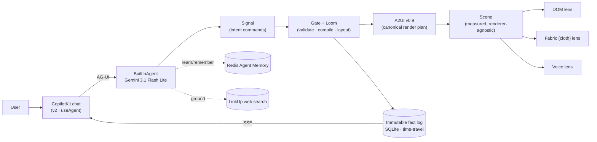

<div align="center">

# ✨ Shine

### One immutable data layer. Infinitely many personalized surfaces.

**Shine is SaaS 2.0:** the data stays constant, and *everything on top* — your dashboard, your theme, your layout, your components, even your rendering engine — is generated per‑user by an agent, and rewindable to any moment in time.

No fixed UI. No DB migrations. No Git required.

<br/>


*Built for the London A2A & A2UI (Generative UI) Hackathon — June 2026.*

</div>

---

## The big idea

> **Facts are truth. Everything you see is derived.**
>
> Shine never updates or deletes data — it **appends immutable facts** through a single validating gate. The agent doesn't write pixels, HTML, or React; it emits compact **business‑intent commands** that compile into a safe, declarative **A2UI** plan. That one decision gives you per‑user UI, time‑travel, audit, undo, and swappable rendering engines — almost for free.

Most "agent UI" is one of two weak extremes: **plain chat** (safe, useless) or **raw generated DOM** (impressive, dangerous, unreviewable, impossible to persist). Shine sits in the middle and gets the best of both: the agent proposes *intent*, the app compiles it into *approved, validated UI*, and the renderer owns layout, theming, accessibility, and actions.

---

## ✨ Novel benefits

### 🧬 SaaS 2.0 — one data layer, a personal app for everyone
Every user is a **"world"** layered over a shared, immutable fact log. The *same* request produces a *visibly different* app per user — different theme, density, component variants, even a different **renderer** — because the compiler reads each world's facts before it builds. The data is shared and constant; the experience is entirely yours.

### 🗣️ The agent speaks *intent*, not pixels
The model emits a tiny **Signal** wire‑protocol (e.g. "render a competitor panel", "I prefer tables", "switch to the cloth renderer"). A deterministic **compile + layout** step ("Loom") turns intent into a canonical **A2UI v0.9** document. The agent can never inject HTML, CSS, JS, or iframes — it can only request *approved* components, validated by a Zod gate before anything renders. This gives you the most of the freedom of unrestricted UI, with safe guardrails (no raw HTML/JS).

### 🪟 Renderers are equals — one UI, many lenses
The same validated UI is rendered three radically different ways, all from one shared **Scene**:
- **DOM** — a clean, branded surface via the real `@copilotkit/a2ui-renderer`, with a slow liquid sway that quietly settles under `prefers-reduced-motion`.
- **Fabric** — a live, high‑res **WebGL cloth** (anisotropic‑filtered texture) you can grab, wobble, and click. Clicks raycast the *deformed* mesh back through UV → hotspot → action.
- **Voice** — the panel projected into a ranked brief and spoken with **Gemini TTS**.

Press **`R`** to cycle the lens (DOM → Cloth → Voice); an agent *"switch renderer"* command or a world switch hands control straight back to the agent. Swap the engine, keep the data. *One Signal, three renderers.*

### ⏳ Time‑travel and infinite undo, built in
Because state is an append‑only log, **drag a slider to see any user's app at any moment in its history.** Scrubbing is buttery (every transaction is client‑cached, no refetch). Nothing is ever lost; every change is attributed in a **Flight Recorder** of receipts — who asked for what, what compiled, what the agent grounded.

### 🧠 Agents that learn, remember, and ground themselves
- **Learn & remember:** preferences you express are written to **Redis Agent Memory** and fed back into the agent on the next turn — across sessions. A *curator* step distills what you like; a *builder* step composes with it.
- **Ground in live web data:** **LinkUp** fetches sourced, cited answers and pipes them straight into a typed A2UI panel.
- **Never pay twice:** every model and web call is a **journaled effect** with a semantic cache — the same generation is recorded once and replayed forever (`reused: true`).

### 🔒 Safe by construction
No raw HTML. No iframes. No arbitrary JS. No unknown data sources or actions. The agent proposes; the host app resolves data, executes actions, and owns layout. Sensitive output is length‑ and shape‑checked before it can render. Per‑user component code is content‑addressed by hash and sandboxed — the user's prompt never reaches it.

---

## How it works



**The layers**

| Layer | What it does |
| --- | --- |
| **Signal** | The agent's compact intent commands — optimized for the model to author. |
| **Loom + Gate** | Deterministic compile + Zod validation. Reads the user's world to personalize. |
| **A2UI v0.9** | The canonical, declarative render plan (`createSurface` / `updateComponents` / `updateDataModel`). |
| **Scene** | A measured, renderer‑agnostic layout — the reason engines are swappable. |
| **Lenses** | DOM · Fabric · Voice, all rendering the same Scene. |
| **Fact log** | Append‑only SQLite truth: time‑travel, receipts, journaled effects, per‑user worlds. |
| **Redis / LinkUp** | The agent's memory, semantic cache, live event bus, and grounded web data. |

---

## The stack (and how each piece is genuinely used)

- **[CopilotKit](https://copilotkit.ai) v2** — the chat + runtime. The UI drives an in‑process `BuiltInAgent` end‑to‑end via `useAgent` (no REST bypass), served natively on **Hono**.
- **[AG-UI](https://docs.ag-ui.com)** — the transport. The agent streams `CUSTOM` + `STATE_SNAPSHOT` + `TEXT_MESSAGE_*` events the frontend consumes.
- **[A2UI v0.9](https://a2ui.org)** — the canonical UI protocol. Our ops match `@a2ui/web_core` field‑for‑field and render through the real `@copilotkit/a2ui-renderer`. The **full standard A2UI catalog is enabled** (`includeBasicCatalog: true`), so the renderer paints *anything* a future agent — or an **A2A partner** — sends, not just our five custom components.
- **[Gemini](https://aistudio.google.com)** — `gemini-3.1-flash-lite` compiles Signal. If Gemini fails, the command fails; there is no heuristic fallback. Gemini TTS speaks the voice lens.
- **[Redis](https://redis.io/iris)** — Agent Memory (`agent-memory-client`), effect/semantic cache, Streams event bus, pub/sub.
- **[LinkUp](https://www.linkup.so)** — sourced, cited web answers piped into A2UI panels when `LINKUP_API_KEY` is set; without it the app shows an honest ungrounded state.
- **Vite + Hono + TypeScript** — an all‑TS monorepo, no build step between packages.

---

## What you'll see

1. **It builds itself** — type a prompt, a beautiful surface compiles from Signal → A2UI.
2. **It diverges** — switch worlds: the *same* prompt yields a different personalized app.
3. **It learns** — "I prefer tables and a calmer palette" → it re‑composes and remembers (Redis).
4. **It grounds** — ask a real‑world question → a sourced, cited panel materializes (LinkUp).
5. **It rewinds** — drag the slider; the whole app rebuilds at any past transaction.
6. **It transforms** — press **`R`** to flip lenses: the same panel becomes a living **cloth** you can grab and click, or **narrates** itself with Gemini voice.

---

## Quickstart

> Prereqs: **Node 24+**, **pnpm**. Redis is optional (Shine degrades gracefully without it).

```bash
pnpm install

cp .env.example .env.local
# set GEMINI_API_KEY (required; the agent does not fall back without it)
# optional, but they light up the sponsor story:
#   LINKUP_API_KEY          → live cited web grounding
#   REDIS_URL               → memory + cache + event bus
#   AGENT_MEMORY_BASE_URL   → Redis Agent Memory (Iris)

pnpm dev          # web on http://localhost:5173, server on :8787
```

Open **http://localhost:5173**, try a prompt, toggle **World A / World B**, drag the timeline, and switch renderers.

```bash
pnpm reset        # wipe the fact log and reseed the two worlds
pnpm typecheck    # type-check every package
```

### Environment

| Variable | Required | Purpose |
| --- | --- | --- |
| `GEMINI_API_KEY` | ✅ | Live agent (Signal compile + TTS). |
| `GEMINI_MODEL` | – | Defaults to `gemini-3.1-flash-lite`. |
| `LINKUP_API_KEY` | – | Live, cited web grounding (free tier ~4k queries). |
| `REDIS_URL` | – | Memory hashes, effect cache, Streams, pub/sub. |
| `AGENT_MEMORY_BASE_URL` | – | Redis Agent Memory (Iris) server. |

---

## Repository

```
apps/
  web/      Vite + React — chat, the three renderers, time-travel scrubber
  server/   Hono — fact-store + gate + SSE + Redis + Gemini + LinkUp + CopilotKit v2 runtime
packages/
  core/     Signal types, the Loom compiler (Signal → A2UI), the Scene model
```

---

## Why it's different

> Shine doesn't generate a web page. It generates a **safe, persistent, product‑native workspace** — one that is uniquely yours, fully auditable, rewindable to any moment, and renderable through any engine. The agent only ever proposes intent; the app stays in charge of truth, layout, and safety.

The killer line: **any agent can give every user their own app, on one shared source of truth.** That's the part that feels new.

---

<div align="center">
<sub>Shine · generative UI on an immutable, time‑travelling, per‑user data layer.</sub>
</div>
